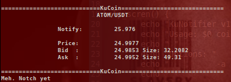

# KuNotifier
===================================

A ticker then sends an sms (or email) to a desired address when a particular value is reached by a coin on KuCoin. 

## Install
First set up a relay mail protocol.

**ssmtp** is descripted here

`apt-get install ssmtp`

Then edit /etc/ssmtp/revaliases.

```
$ cat revaliases 
# sSMTP aliases

# Example: root:your_login@your.domain:mailhub.your.domain[:port]
# where [:port] is an optional port number that defaults to 25.
# /etc/ssmtp/revaliases
# Format: local_account:outgoing_address:mailhub

username:your_email@gmail.com:smtp.gmail.com:587
```

Then set up the relay.

```
$ cat ssmtp.conf 
#
# /etc/ssmtp.conf -- a config file for sSMTP sendmail.

# Gmail
mailhub=smtp.gmail.com:587
rewriteDomain=gmail.com
hostname=smtp.gmail.com:587

AuthUser=username@gmail.com
AuthPass=password

FromLineOverride=YES
UseTLS=YES
USESTARTTLS=YES
```

Gmail will most likely send you a warning about an attempted login. You need to **Allow less secure apps** in your gmail security settings. 

Finally, edit the following line of *ku_notify_ticker.sh*

```
# Edit this to be an e-mail or sms gateway
notification_email="6125551212@txt.att.net"
```

Use an e-mail address or if you want to receive a sms text message pick the correct SMS gateway found here:

[email2sms](./csv/email2sms.csv)

Finally, run *ku_notify_ticker.sh*

## Usage

```
$ ./ku_notify_ticker.sh --help
KuNotifier v1.0 by  ζ(Kₒᵥ)
Usage: ./ku_notify_ticker.sh coin1 coin2 sell_point spread [options]
 
Options: 
          -a  (above price)
 
          spread refers to the increment in which to continually send notifications 
          i.e., if notifications happen at ADA = 2.05 and spread = 0.1, the next notification
          will be sent at ADA = 2.15, if -a is applied, or ADA = 1.95 if not supplying -a
 
NOTE: 
    edit the 'notification_email' variable in the script to send SMS text to your phone
    when the sell-point is reached and for each subsequent spread.
```

KuNotifier will refresh the screen every 90 secods. 

## Screenshot



# Support My Passion

Help me reach my goal of being a full-time crypto coder:

`BTC: bc1qfdfj7zu2l9mvtmgj5na45j7pzesggtnh00v4rx`

`XMR: 88MtpfmHD1564Eefe4eKPnj53sqDPqDBCbeHqFCeShihA27cD9gq8FPPMh2gDaxrhSi2SybaMmB3iQUyDhWWX7f7CipC6GC`

